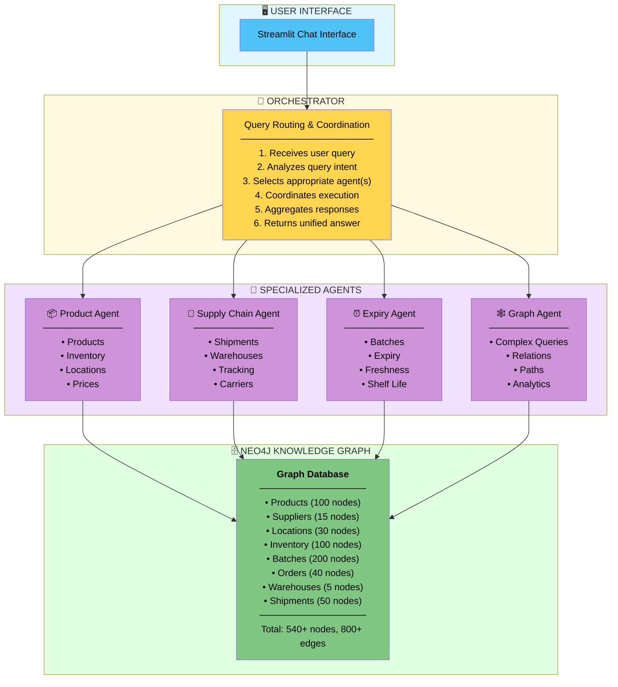

# 🏪 Store Supply Chain Multi-Agent System

A sophisticated AI-powered supply chain management system using **Neo4j Knowledge Graph**, **Llama 3.2-1B**, and **Multi-Agent Architecture** to provide intelligent insights into inventory, shipments, and product lifecycle management.

---

## 📋 Table of Contents

1. [Overview](#overview)
2. [Architecture](#architecture)
3. [Agent Workflows](#agent-workflows)
4. [Features](#features)
5. [Prerequisites](#prerequisites)
6. [Installation](#installation)
7. [Configuration](#configuration)
8. [Running the Application](#running-the-application)
9. [Usage Examples](#usage-examples)
10. [API Reference](#api-reference)
11. [Troubleshooting](#troubleshooting)
12. [Performance Optimization](#performance-optimization)
13. [Development](#development)
14. [Contributing](#contributing)
15. [License](#license)

---

## 🎯 Overview

This system demonstrates a **production-ready multi-agent AI architecture** that coordinates specialized agents to answer complex queries about store operations, supply chain, and inventory management.

### Key Highlights

- **🧠 4 Specialized AI Agents** working collaboratively
- **🕸️ Neo4j Knowledge Graph** as unified data source
- **🦙 Llama 3.2-1B** for natural language understanding
- **🎨 Streamlit UI** for intuitive interaction
- **📊 Real-time Insights** across inventory, shipments, and expiry
- **🔄 No Framework Dependencies** - Pure custom implementation

---

## 🏗️ Architecture

### System Overview



---

## 🔄 Agent Workflows

### Code Flow

```python
def process_query(user_query: str) -> Dict:
    # 1. Select capable agents
    selected_agents = _select_agents(user_query)
    #    - ProductAgent: confidence 0.8
    #    - GraphAgent: confidence 0.4
    
    # 2. Execute agents in parallel
    results = []
    for agent, confidence in selected_agents:
        result = agent.process(user_query)
        results.append(result)
    
    # 3. Aggregate responses
    if len(results) == 1:
        return _format_single_response(results[0])
    else:
        return _format_multi_response(user_query, results)
```

### Decision Tree

```

User Query
    │
    ├─ Contains ['product', 'inventory', 'stock']?
    │   └─ YES → Route to ProductAgent (confidence: 0.7-1.0)
    │
    ├─ Contains ['shipment', 'delivery', 'warehouse']?
    │   └─ YES → Route to SupplyChainAgent (confidence: 0.7-1.0)
    │
    ├─ Contains ['expiry', 'batch', 'fresh']?
    │   └─ YES → Route to ExpiryAgent (confidence: 0.7-1.0)
    │
    ├─ Contains ['supplier', 'relationship', 'everything']?
    │   └─ YES → Route to GraphAgent (confidence: 0.7-1.0)
    │
    └─ Multiple keyword matches?
        └─ Route to multiple agents → Aggregate responses
```

### Product Agent Workflow

**Purpose:** Handles all product, inventory, location, and pricing queries

```

┌─────────────────────────────────────────────────────────────────┐
│                    PRODUCT AGENT WORKFLOW                        │
└─────────────────────────────────────────────────────────────────┘

INPUT: Product-related Query
│
├─ STEP 1: Query Classification
│  ├─ Analyze query keywords
│  └─ Classify into subtypes:
│     ├─ LOW_STOCK: "low stock", "reorder"
│     ├─ LOCATION: "where", "location", "aisle"
│     ├─ PRICE: "price", "cost", "how much"
│     ├─ INVENTORY: "inventory", "stock", "quantity"
│     └─ SEARCH: General product search
│
├─ STEP 2: Query Type Routing
│  │
│  ├─ IF LOW_STOCK:
│  │  └─ Execute: _get_low_stock_products()
│  │     ├─ Cypher: MATCH (p:Product)-[:HAS_INVENTORY]->(i:Inventory)
│  │     │          WHERE i.quantity < i.reorder_level
│  │     └─ Return: Products below reorder level
│  │
│  ├─ IF LOCATION:
│  │  └─ Execute: _get_product_location()
│  │     ├─ Extract: Product name using LLM
│  │     ├─ Cypher: MATCH (p:Product)-[:LOCATED_IN]->(l:Location)
│  │     │          WHERE p.name CONTAINS $product_name
│  │     └─ Return: Aisle, rack, shelf information
│  │
│  ├─ IF PRICE:
│  │  └─ Execute: _get_product_price()
│  │     ├─ Extract: Product name
│  │     ├─ Cypher: MATCH (p:Product)
│  │     │          WHERE p.name CONTAINS $product_name
│  │     └─ Return: Product pricing details
│  │
│  ├─ IF INVENTORY:
│  │  └─ Execute: _get_inventory_info()
│  │     ├─ Check: Specific product or general summary?
│  │     ├─ Cypher: MATCH (p:Product)-[:HAS_INVENTORY]->(i:Inventory)
│  │     └─ Return: Stock levels, reorder points
│  │
│  └─ ELSE (SEARCH):
│     └─ Execute: _search_products()
│        ├─ Extract: Search terms
│        ├─ Cypher: MATCH (p:Product)
│        │          WHERE p.name CONTAINS $term 
│        │             OR p.category CONTAINS $term
│        └─ Return: Matching products
│
├─ STEP 3: Execute Neo4j Query
│  ├─ Connect to Neo4j
│  ├─ Run Cypher query with parameters
│  ├─ Fetch results
│  └─ Handle query errors
│
├─ STEP 4: Process Results
│  ├─ IF results found:
│  │  ├─ Convert to structured format
│  │  ├─ Generate natural language summary using LLM
│  │  └─ Format response
│  │
│  └─ IF no results:
│     └─ Return error message
│
└─ STEP 5: Return Response
   └─ Return {
        agent: "Product & Inventory Agent",
        status: "success",
        data: [...],
        summary: "...",
        record_count: N
     }
```

**OUTPUT:** Formatted Product Response

#### Example Flow

```

User: "Show products with low stock"
    │
    ├─ Keyword Match: "low stock" → confidence 0.9
    │
    ├─ Route to: _get_low_stock_products()
    │
    ├─ Execute Cypher:
    │   MATCH (p:Product)-[:HAS_INVENTORY]->(i:Inventory)
    │   WHERE i.quantity < i.reorder_level
    │   RETURN p.name, i.quantity, i.reorder_level
    │   ORDER BY i.quantity
    │   LIMIT 20
    │
    ├─ Results: [
    │     {name: "Milk", quantity: 8, reorder: 20},
    │     {name: "Bread", quantity: 12, reorder: 25},
    │     ...
    │   ]
    │
    ├─ Generate Summary:
    │   "Based on current inventory, 3 products are below 
    │    reorder levels. Milk (8 units) and Bread (12 units)
    │    need immediate restocking."
    │
    └─ Return Response with data + summary
```

### Supply Chain Agent Workflow

**Purpose:** Handles shipment tracking, warehouse inventory, and delivery queries

```

┌─────────────────────────────────────────────────────────────────┐
│                 SUPPLY CHAIN AGENT WORKFLOW                      │
└─────────────────────────────────────────────────────────────────┘

INPUT: Supply Chain Query
│
├─ STEP 1: Query Classification
│  ├─ Identify query type:
│  │  ├─ ACTIVE_SHIPMENTS: "in transit", "active shipments"
│  │  ├─ WAREHOUSE: "warehouse", "distribution center"
│  │  ├─ TRACKING: "track", "tracking number"
│  │  └─ SUMMARY: General shipment overview
│  │
│  └─ Extract entities (shipment ID, warehouse ID, etc.)
│
├─ STEP 2: Query Type Routing
│  │
│  ├─ IF ACTIVE_SHIPMENTS:
│  │  └─ Execute: _get_active_shipments()
│  │     ├─ Cypher: MATCH (sh:Shipment)
│  │     │          WHERE sh.status IN ['in_transit', 
│  │     │                               'out_for_delivery']
│  │     └─ Return: Active shipment details
│  │
│  ├─ IF WAREHOUSE:
│  │  └─ Execute: _get_warehouse_info()
│  │     ├─ Cypher: MATCH (w:Warehouse)-[:STOCKS]->(p:Product)
│  │     │          WITH w, COUNT(p) as products, 
│  │     │               SUM(quantity) as total
│  │     └─ Return: Warehouse inventory summary
│  │
│  ├─ IF TRACKING:
│  │  └─ Execute: _track_shipment()
│  │     ├─ Extract: Shipment/Tracking ID using LLM
│  │     ├─ Cypher: MATCH (sh:Shipment)
│  │     │          WHERE sh.shipment_id = $id
│  │     │             OR sh.tracking_number = $id
│  │     ├─ Get: Current location, status, ETA
│  │     └─ Return: Complete shipment details
│  │
│  └─ ELSE (SUMMARY):
│     └─ Execute: _get_shipment_summary()
│        ├─ Cypher: MATCH (sh:Shipment)
│        │          WITH sh.status, COUNT(*) as count
│        └─ Return: Statistics by status
│
├─ STEP 3: Execute Neo4j Query
│  ├─ Build parameterized Cypher query
│  ├─ Execute via Neo4j connector
│  └─ Handle connection errors
│
├─ STEP 4: Process Results
│  ├─ Parse shipment/warehouse data
│  ├─ Calculate derived metrics (ETA, delays)
│  ├─ Generate natural language summary
│  └─ Format for user consumption
│
└─ STEP 5: Return Response
   └─ Include: status, location, ETA, carrier info
```

**OUTPUT:** Shipment/Warehouse Information

#### Tracking Flow Example

```

User: "Track shipment SH20241224001"
    │
    ├─ Extract: "SH20241224001" using LLM
    │
    ├─ Execute Cypher:
    │   MATCH (sh:Shipment {shipment_id: "SH20241224001"})
    │   -[:FULFILLS]->(o:Order)
    │   RETURN sh.status, sh.current_city, sh.carrier,
    │          sh.estimated_arrival, o.order_id
    │
    ├─ Results: {
    │     status: "in_transit",
    │     current_city: "Pune",
    │     carrier: "FastShip Logistics",
    │     estimated_arrival: "2024-12-25 14:00",
    │     order_id: "ORD0123"
    │   }
    │
    ├─ Generate Summary:
    │   "Shipment SH20241224001 is currently in transit.
    │    Location: Pune. Carrier: FastShip Logistics.
    │    Expected arrival: Dec 25 at 2:00 PM.
    │    Order: ORD0123"
    │
    └─ Return formatted tracking info
```

### Expiry Agent Workflow

**Purpose:** Manages product expiry, batch tracking, and freshness monitoring

```

┌─────────────────────────────────────────────────────────────────┐
│                    EXPIRY AGENT WORKFLOW                         │
└─────────────────────────────────────────────────────────────────┘

INPUT: Expiry-related Query
│
├─ STEP 1: Query Classification
│  ├─ Identify query intent:
│  │  ├─ EXPIRING_SOON: "expiring soon", "near expiry"
│  │  ├─ EXPIRED: "expired", "past expiry"
│  │  ├─ BATCH_INFO: "batch", "batch ID"
│  │  └─ SUMMARY: General expiry overview
│  │
│  └─ Determine time window (7 days, 30 days, etc.)
│
├─ STEP 2: Query Type Routing
│  │
│  ├─ IF EXPIRING_SOON:
│  │  └─ Execute: _get_expiring_soon()
│  │     ├─ Cypher: MATCH (p:Product)-[:HAS_BATCH]->(b:Batch)
│  │     │          WHERE b.status IN ['active', 'near_expiry']
│  │     │          WITH b, duration.between(
│  │     │               date(), date(b.expiry_date)
│  │     │          ).days as days_left
│  │     │          WHERE days_left <= 7 AND days_left >= 0
│  │     └─ Return: Products expiring in next 7 days
│  │
│  ├─ IF EXPIRED:
│  │  └─ Execute: _get_expired_products()
│  │     ├─ Cypher: MATCH (p:Product)-[:HAS_BATCH]->(b:Batch)
│  │     │          WHERE b.status = 'expired'
│  │     └─ Return: Expired batches with details
│  │
│  ├─ IF BATCH_INFO:
│  │  └─ Execute: _get_batch_info()
│  │     ├─ Extract: Batch ID using LLM
│  │     ├─ Cypher: MATCH (p:Product)-[:HAS_BATCH]->(b:Batch)
│  │     │          WHERE b.batch_id = $batch_id
│  │     └─ Return: Complete batch information
│  │
│  └─ ELSE (SUMMARY):
│     └─ Execute: _get_expiry_summary()
│        ├─ Cypher: MATCH (p:Product)-[:HAS_BATCH]->(b:Batch)
│        │          GROUP BY p.category, b.status
│        └─ Return: Expiry statistics by category
│
├─ STEP 3: Execute Neo4j Query
│  ├─ Use Neo4j date functions for calculations
│  ├─ Filter by batch status
│  └─ Sort by urgency (days until expiry)
│
├─ STEP 4: Calculate Urgency
│  ├─ Days until expiry:
│  │  ├─ 0-3 days: CRITICAL ⚠️
│  │  ├─ 4-7 days: WARNING ⚡
│  │  └─ 8+ days: NORMAL ✅
│  │
│  └─ Generate recommendations
│
├─ STEP 5: Generate Summary
│  ├─ Prioritize critical items
│  ├─ Suggest actions (discount, remove, etc.)
│  └─ Format user-friendly message
│
└─ STEP 6: Return Response
   └─ Include: expiry dates, urgency levels, actions
```

**OUTPUT:** Expiry Information & Recommendations

#### Expiry Detection Flow

```

User: "Which products are expiring soon?"
    │
    ├─ Keyword: "expiring soon" → confidence 0.95
    │
    ├─ Route to: _get_expiring_soon()
    │
    ├─ Execute Cypher:
    │   MATCH (p:Product)-[:HAS_BATCH]->(b:Batch)
    │   WHERE b.status IN ['active', 'near_expiry']
    │   WITH p, b,
    │        duration.between(date(), date(b.expiry_date)).days 
    │        as days_left
    │   WHERE days_left <= 7 AND days_left >= 0
    │   RETURN p.name, p.category, b.batch_id, 
    │          b.expiry_date, days_left, b.quantity
    │   ORDER BY days_left
    │
    ├─ Results: [
    │     {name: "Milk", days_left: 2, quantity: 15},
    │     {name: "Yogurt", days_left: 4, quantity: 20},
    │     ...
    │   ]
    │
    ├─ Calculate Urgency:
    │   Milk: CRITICAL (2 days) ⚠️
    │   Yogurt: WARNING (4 days) ⚡
    │
    ├─ Generate Summary:
    │   "URGENT: 2 products expiring in next 7 days.
    │    
    │    Critical (2 days):
    │    - Milk: 15 units (consider discount or removal)
    │    
    │    Warning (4 days):
    │    - Yogurt: 20 units (monitor closely)"
    │
    └─ Return with urgency indicators
```

### Graph Agent Workflow

**Purpose:** Handles complex relationship queries across the knowledge graph

```

┌─────────────────────────────────────────────────────────────────┐
│                    GRAPH AGENT WORKFLOW                          │
└─────────────────────────────────────────────────────────────────┘

INPUT: Complex Relationship Query
│
├─ STEP 1: Query Analysis
│  ├─ Identify complexity:
│  │  ├─ Multi-hop relationships
│  │  ├─ Cross-domain queries
│  │  ├─ Path finding
│  │  └─ Complete entity views
│  │
│  └─ Determine query pattern:
│     ├─ SUPPLIER_QUERY: "who supplies", "supplier for"
│     ├─ SUPPLY_CHAIN: "supply chain", "path from"
│     ├─ COMPLETE_INFO: "everything about", "all info"
│     └─ DYNAMIC: Complex custom queries
│
├─ STEP 2: Query Pattern Matching
│  │
│  ├─ IF SUPPLIER_QUERY:
│  │  └─ Execute: _get_product_suppliers()
│  │     ├─ Cypher: MATCH (p:Product)-[r:SUPPLIED_BY]->(s:Supplier)
│  │     │          WHERE p.name CONTAINS $product
│  │     │          RETURN p, r, s, supplier details
│  │     └─ Return: Supplier relationships
│  │
│  ├─ IF SUPPLY_CHAIN:
│  │  └─ Execute: _get_supply_chain_path()
│  │     ├─ Cypher: MATCH path = 
│  │     │          (s:Supplier)<-[:SUPPLIED_BY]-(p:Product)
│  │     │          -[:HAS_INVENTORY]->(i:Inventory)
│  │     └─ Return: Complete supply chain paths
│  │
│  ├─ IF COMPLETE_INFO:
│  │  └─ Execute: _get_complete_info()
│  │     ├─ Extract: Entity name
│  │     ├─ Cypher: MATCH (p:Product)
│  │     │          WHERE p.name CONTAINS $entity
│  │     │          OPTIONAL MATCH (p)-[:LOCATED_IN]->(l)
│  │     │          OPTIONAL MATCH (p)-[:SUPPLIED_BY]->(s)
│  │     │          OPTIONAL MATCH (p)-[:HAS_INVENTORY]->(i)
│  │     │          OPTIONAL MATCH (p)-[:HAS_BATCH]->(b)
│  │     │          RETURN p, collect(l), collect(s), i, count(b)
│  │     └─ Return: Complete entity network
│  │
│  └─ ELSE (DYNAMIC):
│     └─ Execute: _dynamic_query()
│        ├─ Get graph schema
│        ├─ Generate Cypher using LLM:
│        │  Prompt: "Given schema: {...}
│        │           Generate Cypher for: {user_query}"
│        ├─ Parse generated Cypher
│        ├─ Validate query structure
│        ├─ Execute dynamic query
│        └─ Return results
│
├─ STEP 3: Execute Graph Traversal
│  ├─ Leverage Neo4j graph algorithms
│  ├─ Use OPTIONAL MATCH for flexible queries
│  ├─ Collect related nodes/relationships
│  └─ Handle complex join patterns
│
├─ STEP 4: Result Processing
│  ├─ Flatten nested graph structures
│  ├─ Aggregate related entities
│  ├─ Calculate derived insights
│  └─ Generate comprehensive summary
│
└─ STEP 5: Return Rich Response
   └─ Include: relationships, paths, connected entities
```

**OUTPUT:** Complex Graph Query Results

#### Dynamic Query Generation Flow

```

User: "Show me everything about milk - suppliers, stock, and expiry"
    │
    ├─ Keyword: "everything" → GraphAgent selected
    │
    ├─ Pattern Match: COMPLETE_INFO
    │
    ├─ Extract: Entity = "milk"
    │
    ├─ Build Complex Cypher:
    │   MATCH (p:Product)
    │   WHERE toLower(p.name) CONTAINS 'milk'
    │   
    │   // Get locations
    │   OPTIONAL MATCH (p)-[:LOCATED_IN]->(l:Location)
    │   
    │   // Get suppliers
    │   OPTIONAL MATCH (p)-[r:SUPPLIED_BY]->(s:Supplier)
    │   
    │   // Get inventory
    │   OPTIONAL MATCH (p)-[:HAS_INVENTORY]->(i:Inventory)
    │   
    │   // Get batches
    │   OPTIONAL MATCH (p)-[:HAS_BATCH]->(b:Batch)
    │   WHERE b.status IN ['active', 'near_expiry']
    │   
    │   RETURN 
    │     p.product_id, p.name, p.category, p.base_price,
    │     collect(DISTINCT {
    │       aisle: l.aisle, 
    │       rack: l.rack
    │     }) as locations,
    │     collect(DISTINCT {
    │       name: s.name, 
    │       reliability: s.reliability_score,
    │       cost: r.unit_cost
    │     }) as suppliers,
    │     i.quantity as stock,
    │     i.reorder_level,
    │     count(DISTINCT b) as active_batches
    │
    ├─ Execute Query
    │
    ├─ Results: {
    │     product_id: "P0042",
    │     name: "Fresh Milk",
    │     category: "Dairy",
    │     base_price: 3.99,
    │     locations: [{aisle: "A3", rack: "R12"}],
    │     suppliers: [
    │       {name: "DairyFresh", reliability: 0.95, cost: 2.50}
    │     ],
    │     stock: 45,
    │     reorder_level: 20,
    │     active_batches: 3
    │   }
    │
    ├─ Generate Comprehensive Summary:
    │   "Here's complete information about Fresh Milk:
    │   
    │   **Product Details:**
    │   - ID: P0042
    │   - Category: Dairy
    │   - Price: $3.99
    │   
    │   **Location:**
    │   - Aisle A3, Rack R12
    │   
    │   **Supply Chain:**
    │   - Supplier: DairyFresh (95% reliable)
    │   - Unit Cost: $2.50
    │   
    │   **Inventory:**
    │   - Current Stock: 45 units
    │   - Reorder Level: 20 units
    │   - Status: ✅ Adequate stock
    │   
    │   **Freshness:**
    │   - 3 active batches
    │   - All batches within expiry date"
    │
    └─ Return complete structured response
```

### Multi-Agent Collaboration Flow

**Scenario:** Complex Cross-Domain Query

**User Query:** "Show me dairy products that are low in stock and expiring soon"

```

┌─────────────────────────────────────────────────────────────────┐
│              MULTI-AGENT COLLABORATION FLOW                      │
└─────────────────────────────────────────────────────────────────┘

1. ORCHESTRATOR receives query
   │
   ├─ Analyzes keywords: ["dairy", "low stock", "expiring"]
   │
   ├─ Agent Selection:
   │  ├─ ProductAgent: confidence 0.7 (inventory aspect)
   │  └─ ExpiryAgent: confidence 0.8 (expiry aspect)
   │
   └─ Decision: Execute BOTH agents

2. PARALLEL EXECUTION
   │
   ├─ ProductAgent executes:
   │  │
   │  ├─ Query: Get dairy products with low stock
   │  │   MATCH (p:Product)-[:HAS_INVENTORY]->(i:Inventory)
   │  │   WHERE p.category = 'Dairy' 
   │  │     AND i.quantity < i.reorder_level
   │  │
   │  └─ Returns: [
   │       {name: "Milk", stock: 8, reorder: 20},
   │       {name: "Yogurt", stock: 15, reorder: 25}
   │     ]
   │
   └─ ExpiryAgent executes:
      │
      ├─ Query: Get dairy products expiring soon
      │   MATCH (p:Product)-[:HAS_BATCH]->(b:Batch)
      │   WHERE p.category = 'Dairy'
      │     AND b.expiry_date <= date() + duration({days: 7})
      │
      └─ Returns: [
           {name: "Milk", expiry: "2024-12-27", days: 3},
           {name: "Cheese", expiry: "2024-12-30", days: 6}
         ]

3. ORCHESTRATOR aggregates results
   │
   ├─ Combine responses:
   │  ProductAgent: 2 low-stock dairy items
   │  ExpiryAgent: 2 expiring dairy items
   │
   ├─ Identify overlap:
   │  "Milk" appears in BOTH responses
   │  → CRITICAL: Low stock AND expiring soon!
   │
   └─ Generate Unified Summary using LLM:
      
      Prompt: "User asked about dairy products with low stock 
               and expiring soon.
               
               ProductAgent found: {low stock data}
               ExpiryAgent found: {expiry data}
               
               Provide unified summary highlighting critical items."

4. LLM generates unified response:
   │
   └─ "⚠️ URGENT: Milk requires immediate attention!
      
      **Critical Issues:**
      - Milk: LOW STOCK (8 units, needs 20) + EXPIRING (3 days)
      
      **Low Stock (but not expiring):**
      - Yogurt: 15 units (reorder level: 25)
      
      **Expiring Soon (but adequate stock):**
      - Cheese: Expires in 6 days
      
      **Recommended Actions:**
      1. Milk: Discount heavily or remove (low stock + expiring)
      2. Yogurt: Place reorder with supplier
      3. Cheese: Monitor for discount opportunity"

5. ORCHESTRATOR returns formatted response
   │
   └─ Response: {
        status: "success",
        agent_count: 2,
        agents_used: ["Product Agent", "Expiry Agent"],
        unified_summary: "...",
        individual_results: [...],
        total_records: 4,
        critical_items: ["Milk"]
     }

OUTPUT: Comprehensive Multi-Agent Response
```

#### Key Collaboration Benefits

- **Parallel Processing** - Agents work simultaneously
- **Domain Expertise** - Each agent focuses on its specialty
- **Result Fusion** - Orchestrator combines insights
- **Critical Detection** - Identifies overlapping issues
- **Actionable Insights** - Provides specific recommendations

---

## ✨ Features

### Core Capabilities

- ✅ **Natural Language Queries** - Ask questions in plain English
- ✅ **Multi-Agent Coordination** - 4 specialized agents working together
- ✅ **Knowledge Graph Queries** - Complex relationship traversal
- ✅ **Real-time Insights** - Up-to-date information from Neo4j
- ✅ **Intelligent Routing** - Automatic query classification
- ✅ **Response Aggregation** - Unified answers from multiple sources
- ✅ **Error Handling** - Graceful degradation

### Agent Specializations

#### 🟦 Product Agent

- Product search and details
- Inventory level monitoring
- Location tracking (aisle, rack, shelf)
- Price information
- Low stock alerts
- Reorder recommendations

#### 🟩 Supply Chain Agent

- Shipment tracking
- Warehouse inventory
- Delivery status and ETA
- Carrier information
- Distribution center insights
- Order fulfillment status

#### 🟨 Expiry Agent

- Batch tracking
- Expiry date monitoring
- Near-expiry alerts (7-day window)
- Expired product identification
- Freshness scoring
- Category-wise expiry statistics

#### 🟪 Graph Agent

- Supplier relationships
- Supply chain path analysis
- Multi-hop queries
- Complete entity information
- Cross-domain insights
- Dynamic Cypher generation

---

## 📦 Prerequisites

- **Python 3.9+**
- **uv** (already installed ✅)
- **PostgreSQL 14+**
- **MongoDB 6+**
- **Neo4j 5+**

---

## 🚀 Installation & Setup

### Step 1: Clone Repository

```bash
git clone <your-repository-url>
cd store_supply_chain
```

### Step 2: Create Virtual Environment

```bash
# Create virtual environment with uv
uv venv --python 3.9

# Activate virtual environment
# macOS/Linux:
source .venv/bin/activate

# Windows:
.venv\Scripts\activate
```

### Step 3: Install Dependencies

```bash
# Install all dependencies (fast with uv!)
uv pip install -e .

# Or from requirements.txt:
uv pip install -r requirements.txt
```

### Step 4: Configure Databases

Edit configuration files with your credentials:

**[`config/db_config.py`](config/db_config.py):**
```python
POSTGRES_CONFIG = {
    'host': 'localhost',
    'port': 5432,
    'user': 'postgres',
    'password': 'your_password',  # Update this
}
```

**[`config/neo4j_config.py`](config/neo4j_config.py):**
```python
NEO4J_CONFIG = {
    'uri': 'bolt://localhost:7687',
    'user': 'neo4j',
    'password': 'password',  # Update this
}
```

### Step 5: Start Database Services

```bash
# PostgreSQL
brew services start postgresql@14  # macOS
# sudo systemctl start postgresql  # Linux

# MongoDB
brew services start mongodb-community  # macOS
# sudo systemctl start mongod         # Linux

# Neo4j - Start from Neo4j Desktop or:
neo4j start
```

### Step 6: Setup Databases

```bash
# 1. Generate synthetic data
python scripts/01_generate_data.py

# 2. Setup PostgreSQL
python scripts/02_setup_postgresql.py

# 3. Setup MongoDB
python scripts/03_setup_mongodb.py

# 4. Create Neo4j Knowledge Graph
python scripts/06_create_knowledge_graph.py

# 5. Verify setup
python scripts/04_verify_setup.py
```

### Step 7: Run Application

```bash
# Start Streamlit UI
streamlit run ui/streamlit_app.py
```

Open `http://localhost:8501` in your browser.

---

## 🎯 Quick Setup (All Commands)

```bash
# Setup
cd store_supply_chain
uv venv --python 3.9
source .venv/bin/activate
uv pip install -e .

# Database setup (ensure services are running!)
python scripts/01_generate_data.py
python scripts/02_setup_postgresql.py
python scripts/03_setup_mongodb.py
python scripts/06_create_knowledge_graph.py
python scripts/04_verify_setup.py

# Run
streamlit run ui/streamlit_app.py
```

---


