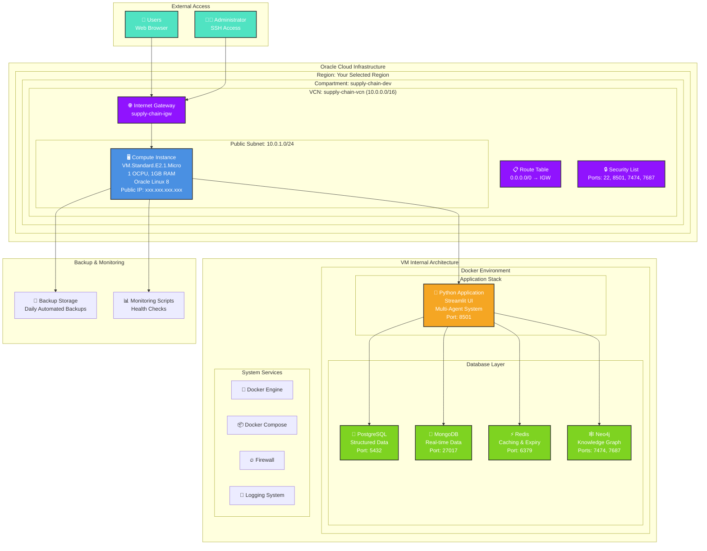
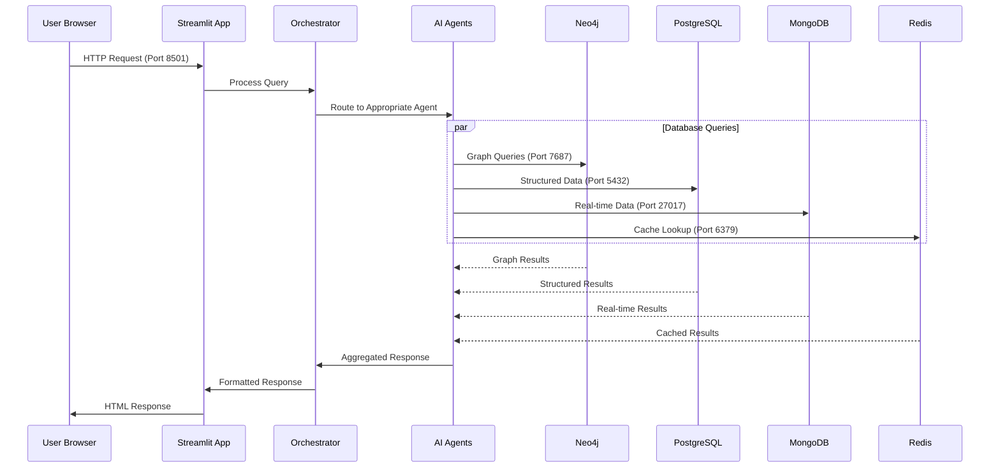
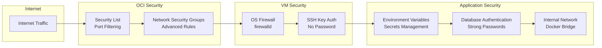
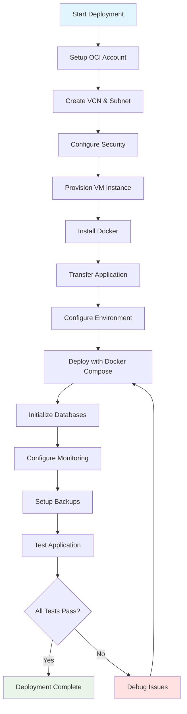

# Oracle Cloud Deployment Architecture
 
## 🏗️ Infrastructure Architecture Diagram
 

 
## 🔄 Data Flow Architecture
 

 
## 🛡️ Security Architecture
 

 
## 📊 Resource Allocation
 
| Component | CPU | Memory | Storage | Network |
|-----------|-----|--------|---------|---------|
| **VM Instance** | 1 OCPU | 1 GB | 50 GB | 1 Gbps |
| **Streamlit App** | ~20% | ~200 MB | ~1 GB | Primary |
| **PostgreSQL** | ~15% | ~150 MB | ~5 GB | Internal |
| **MongoDB** | ~15% | ~150 MB | ~5 GB | Internal |
| **Redis** | ~10% | ~100 MB | ~1 GB | Internal |
| **Neo4j** | ~25% | ~300 MB | ~10 GB | Internal |
| **System Overhead** | ~15% | ~100 MB | ~28 GB | - |
 
## 🔌 Port Configuration
 
| Service | Internal Port | External Port | Protocol | Access |
|---------|---------------|---------------|----------|---------|
| SSH | 22 | 22 | TCP | Public |
| Streamlit | 8501 | 8501 | TCP | Public |
| Neo4j HTTP | 7474 | 7474 | TCP | Public |
| Neo4j Bolt | 7687 | 7687 | TCP | Public |
| PostgreSQL | 5432 | - | TCP | Internal |
| MongoDB | 27017 | - | TCP | Internal |
| Redis | 6379 | - | TCP | Internal |
 
## 🔄 Deployment Workflow
 

 
## 🎯 Success Criteria
 
### Infrastructure Ready ✅
- [ ] VCN and subnet created with proper CIDR blocks
- [ ] Security lists configured with required ports
- [ ] VM instance running with public IP assigned
- [ ] SSH access working with key-based authentication
 
### Application Deployed ✅
- [ ] All Docker containers running successfully
- [ ] Databases initialized with sample data
- [ ] Streamlit UI accessible via public IP
- [ ] All AI agents responding to queries
 
### Production Ready ✅
- [ ] Monitoring scripts configured and running
- [ ] Backup strategy implemented and tested
- [ ] Firewall rules properly configured
- [ ] SSL certificate installed (if domain available)
 
This architecture provides a clear visual representation of your Oracle Cloud deployment structure and the relationships between all components.
 
 